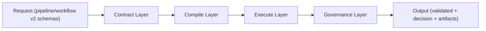

# North-Star Research Architecture (v2)

This document defines the target architecture for Pointline research execution.
It is the concise reference for both human researchers and LLM agents.

## Summary

North-star target:

- One contract-first system for research execution.
- One single-mode execution API (`research.pipeline`) plus one hybrid composition API (`research.workflow`).
- One canonical PIT timeline policy and deterministic ordering policy.
- One governance model: registry-based operators/rollups + mandatory quality gates + lineage artifacts.

## Scope

In scope:

- Feature engineering, resample/aggregate, and hybrid mode composition.
- PIT safety, determinism, validation, artifacts, and decision outputs.

Out of scope:

- Live execution, portfolio/risk engine, and order routing.

## Canonical Public APIs

1. `research.pipeline(request: QuantResearchInputV2) -> QuantResearchOutputV2`
2. `research.workflow(request: QuantResearchWorkflowInputV2) -> QuantResearchWorkflowOutputV2`

Rules:

- `research.pipeline` remains single-mode (`event_joined`, `tick_then_bar`, `bar_then_feature`).
- Hybrid/multi-stage execution uses `research.workflow`.
- No legacy orchestration paths as production entrypoints.

## Four-Layer Architecture

1. Contract Layer:
- Owns schema validation and normalization.
- Inputs/outputs are versioned and machine-validated.

2. Compile Layer:
- Translates request contract into executable stage plan/DAG.
- Resolves operator and rollup metadata (mode, semantic, params, required columns).

3. Execute Layer:
- Runs mode kernels deterministically.
- Handles source loading, PIT-safe joins, bucket assignment, feature computation, and aggregation.

4. Governance Layer:
- Enforces quality gates (lookahead, PIT ordering, partition safety, reproducibility).
- Emits lineage/artifacts and final decision payload.

## High-Level Flow

## Canonical Invariants

1. Timeline semantics:
- Half-open windows: `[T_prev, T)`.
- Strict bound: `ts < bucket_end`.

2. PIT and labels:
- Features must be backward-only.
- Forward-looking logic is label-only and isolated from feature computation.

3. Determinism:
- Time-aware operations must use canonical sort/tie-break keys:
  `exchange_id`, `symbol_id`, `ts_local_us`, `file_id`, `file_line_number`.

4. Stateful safety:
- Stateful transforms (for example rolling, `diff`, `pct_change`) must be partitioned by symbol keys.

## Operator and Rollup Governance

- All production operators and custom rollups are registry-managed.
- Registry metadata must include at least:
  `name`, `required_columns`, `mode_allowlist`, `pit_policy`, `determinism_policy`, `impl_ref`, `version`.
- Custom rollups are repo-registered implementations (no ad-hoc runtime code injection).
- Invalid names, params, semantic mismatches, or disallowed modes fail at compile time.

## Human + LLM Working Model

Human researchers:

- Define objective, constraints, and evaluation criteria.
- Review gate evidence and make final promotion decisions.

LLM agents:

- Draft/normalize requests and propose plans.
- Operate strictly through contracts and framework APIs.
- Must not bypass gate checks or registry constraints.

## Milestones

1. M1: v2 schemas + validators + fixtures.
2. M2: shared compiler/executor kernel + gate engine.
3. M3: `bar_then_feature` production-ready with golden tests.
4. M4: `tick_then_bar` and `event_joined` on same stack.
5. M5: hard switch to v2-only production path (legacy removed).
6. M6: governance lock (CI checks + canonical docs only).

## Acceptance Criteria

1. Single-mode requests run only through `research.pipeline`.
2. Hybrid requests run only through `research.workflow`.
3. All modes share one compiler/executor/governance framework.
4. PIT/determinism/partition gates are mandatory and fail-fast on critical failures.
5. Output contracts and artifacts are schema-valid and reproducible.

## Related Documents

- `docs/architecture/archive/adr-research-framework-v2-clean-architecture.md`
- `docs/architecture/archive/resample-aggregate-design.md`
- `docs/guides/research-pipeline-v2.md`
- `docs/guides/research-workflow-hybrid.md`
