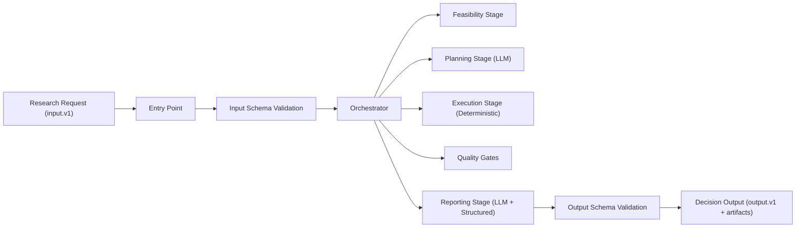

# Quant Agent Architecture

This document proposes the architecture for an automated Quant Researcher agent in Pointline.

## Goals

- Turn research requests into reproducible, PIT-safe experiments.
- Combine deterministic data workflows with LLM reasoning where it adds value.
- Enforce explicit input/output contracts to keep runs reliable and automatable.

## Non-Goals

- Live order execution.
- Portfolio deployment automation.
- Replacing human approval for high-impact strategy decisions.

## Architecture Overview

The recommended architecture is a hybrid design:

- Deterministic workflow engine for validation, data access, metrics, and quality gates.
- LLM assistant layer for experiment planning and result interpretation.
- Strict schema boundary (`input.v1` and `output.v1`) between request, execution, and reporting.

## High-Level Flow

## Stage Responsibilities

### 1. Intake and Normalization

- Validate request identity and schema version.
- Normalize timestamps, timezone, and universe fields.
- Resolve mode (`AUTO`, `HFT`, `MFT`) for downstream behavior.

### 2. Feasibility

- Confirm symbols/exchanges/tables are valid.
- Run table availability checks.
- Run short probe queries in target windows to verify real row presence.
- Emit structured feasibility evidence for later reporting.

### 3. Planning (LLM)

- Convert objective into an executable experiment spec.
- Define features, joins, labels, and evaluation plan.
- Ensure PIT-safe semantics are explicit (e.g., backward as-of joins when required).
- Produce a structured plan payload that can be executed deterministically.

### 4. Execution (Deterministic)

- Perform data loading, joins, feature generation, and metric computation.
- Use reproducible defaults and explicit timelines.
- Persist run artifacts for auditability.

### 5. Quality Gates

- Lookahead/leakage checks.
- PIT ordering checks.
- Reproducibility checks (input/config/hash evidence).
- Enforce gate policy: block `go` decisions if critical checks fail.

### 6. Reporting (LLM + Structured)

- Assemble facts, regime summaries, and interpretation.
- Separate observed facts from analytical interpretation.
- Emit machine-validated output contract for downstream automation.

## LLM Integration Strategy

Use the LLM where judgment helps and keep deterministic logic in code.

LLM responsibilities:
- Hypothesis decomposition.
- Experiment design narrative.
- Interpretation and decision rationale.

Deterministic responsibilities:
- Schema validation.
- Data access and joins.
- Metric calculation.
- Gate enforcement.

## Contract-First Design

The agent must operate only on explicit contracts:

- Input schema: request details, constraints, evaluation config.
- Output schema: feasibility evidence, experiment spec, quality gates, results, decision.

Benefits:
- Reliable automation.
- Easier testing and regression tracking.
- Safer integration with CI or scheduled runs.

## Decision and Safety Policy

- `go` allowed only when critical quality gates pass.
- `revise` required when evidence is incomplete or robustness is weak.
- `reject` when data or methodology invalidates the hypothesis.

Every decision must include:
- rationale,
- key risks,
- explicit next actions.

## Observability and Auditability

Each run should record:

- request ID and run ID,
- schema versions,
- normalized input hash,
- timing/status,
- feasibility and gate evidence,
- output decision payload.

This supports reproducibility, incident triage, and model behavior review.

## Deployment and Operating Model

Recommended progression:

1. Shadow mode: agent proposes; humans execute and review.
2. Assisted mode: agent executes; humans approve decisions.
3. Guarded autonomy: agent runs predefined low-risk classes automatically.

## Performance and Cost Considerations

- Keep LLM context minimal and stage-scoped.
- Prefer probe queries before full scans.
- Cache symbol/coverage metadata per run.
- Avoid re-planning when normalized inputs are unchanged.

## Risks and Mitigations

- Risk: LLM overconfident interpretation.
- Mitigation: gate-enforced decision policy + facts vs interpretation separation.

- Risk: false confidence from availability checks alone.
- Mitigation: mandatory probe-row checks on requested windows.

- Risk: hidden lookahead leakage.
- Mitigation: explicit leakage tests + PIT timeline policy.

## Evolution Path

- Add domain-specific templates for HFT and MFT modes.
- Expand benchmark tasks for regression testing.
- Add richer uncertainty reporting and confidence intervals.
- Introduce policy-driven escalation for ambiguous decisions.
